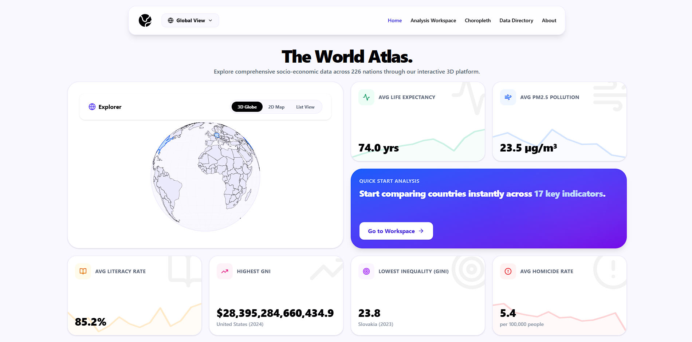
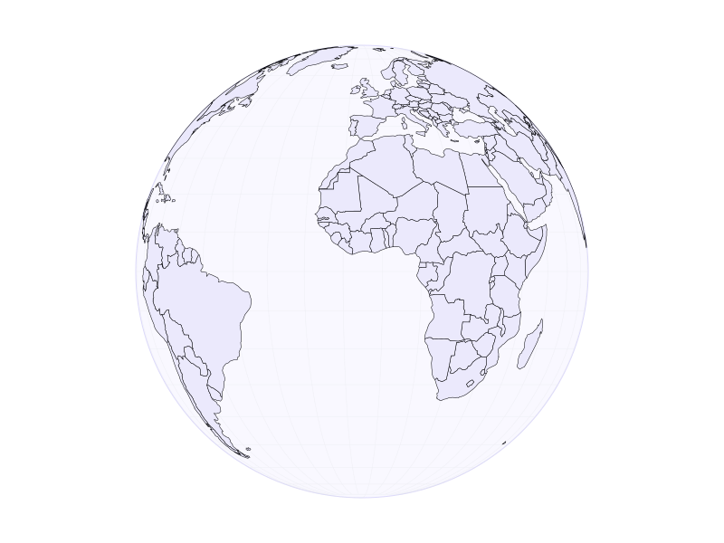
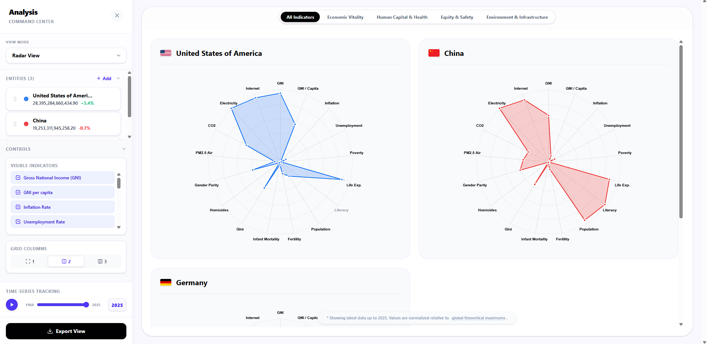
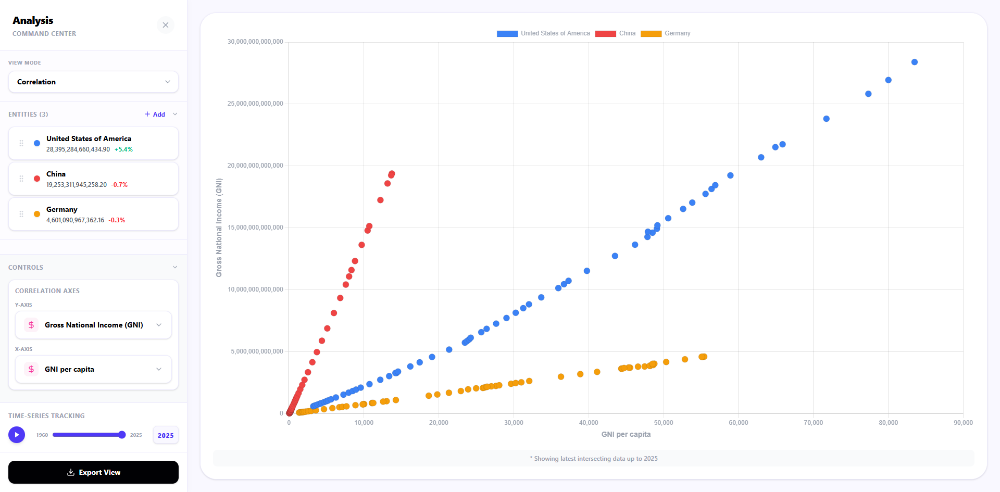
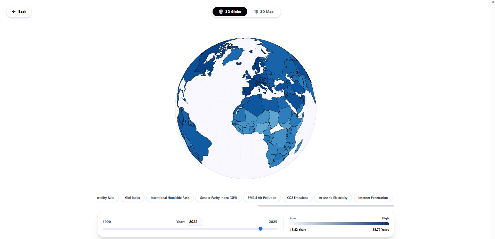
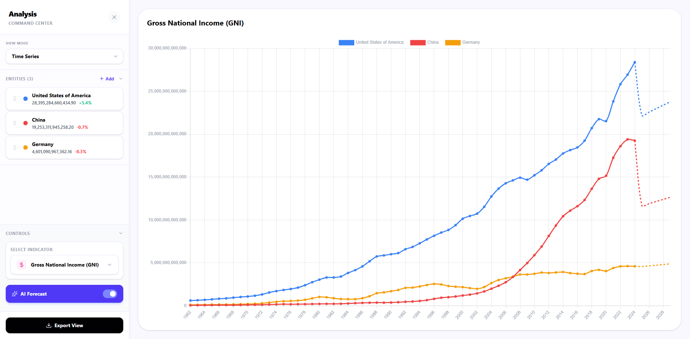
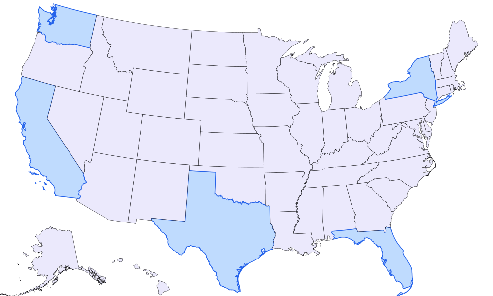
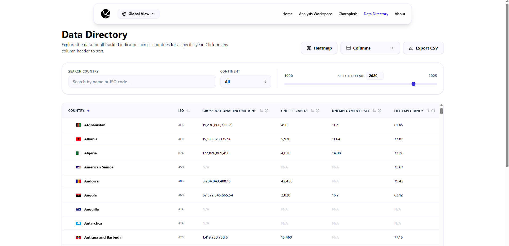

  
  
  
  
  
  
  

 

  <h1 align="center">The World Atlas</h1>
  

    <strong>Global Macroeconomic Analytics & Structural AI Forecasting</strong>
     
     
    <a href="https://the-world-atlas.vercel.app"><strong>View Live Platform »</strong></a>
     
     
    <a href="https://github.com/Minaa111/the-world-atlas"><strong>Repository</strong></a> · 
    <a href="https://github.com/Minaa111"><strong>GitHub</strong></a> · 
    <a href="https://www.linkedin.com/in/minaa-aziz/"><strong>LinkedIn</strong></a>
  

   
  
  
<em>Proudly selected as one of the Top 80 Graduation Projects at Arab Open University (2026).</em>

  

---

## 📖 About The Project

**The World Atlas** is a powerful, full-stack web application designed to make complex global socio-economic data intuitive, accessible, and deeply analytical. It bridges the gap between raw statistical data—sourced from organizations like the World Bank—and visually stunning, highly interactive user interfaces. 

By utilizing over 50 years of historical data, the platform allows researchers to cross-examine nations on multiple developmental axes simultaneously. What truly sets The World Atlas apart is its integration of on-the-fly **Structural AI Forecasting**, empowering users to project future global trajectories instantly.

---

## ✨ Core Features

### 🌍 Multi-Modal Global Navigation
Navigate and select sovereign states using three distinct interface modes tailored for different spatial workflows:
- **3D Globe:** A highly interactive, spinning globe visualization for rich spatial context.
- **2D Map:** A flat geospatial TopoJSON projection for rapid, simultaneous country selection.
- **List View:** A streamlined, alphabetical directory for quick searching.

  

### 📊 The Analysis Workspace
A highly complex, state-driven analytical sandbox to compare global economies. Users can cross-examine active dimensions (e.g., Gini Index, PM2.5 Pollution, Life Expectancy) across selected countries using multiple synchronized views:
- **Time-Series:** Track historical trajectories and overlay AI predictions.
- **Bar Charts:** Conduct direct cross-sectional comparisons for a specific year.
- **Radar & Polar Area Views:** Compare countries across multiple thematic indicators simultaneously, normalized against global theoretical maximums.
- **Correlation Scatter Plots:** Map two distinct metrics against each other to identify underlying global correlations.
- **Data Table:** Inspect the raw numerical datasets driving the visualizations.

  
   
  

### 🗺️ Dynamic Choropleth Mapping
Visualize a single macroeconomic indicator across the entire planet simultaneously. The platform renders dynamic heatmaps across both the 3D globe and 2D map geometries using **D3.js**, allowing for the immediate visual identification of global socio-economic disparities.

  

### 🤖 Structural AI Forecasting
Go beyond historical data. When a user enables AI forecasting, the frontend routes the request to a Python backend where a **Scikit-Learn** Machine Learning pipeline is triggered. The system trains a Linear Regression model on historical data trends and instantly generates a 5-year future trajectory. This simulated AI data is returned and seamlessly merged into the active UI state, clearly differentiating historical truth from predicted outcomes.

  

### 📍 Deep-Dive Individual Country Profiles
The platform's architecture is built for scalability. To demonstrate its micro-national capabilities, it features isolated profiles for the **USA, Canada, and Australia**. These profiles utilize custom regional mapping geometries (e.g., states, provinces, territories) and simulated localized datasets, all fully integrated into the Analysis Workspace.

  

### 🗂️ Data Directory
A centralized hub for exploring the underlying historical datasets. It provides complete transparency into indicator metadata, statistical distributions, and historical completeness for all 17 tracked dimensions.

  

---

## 🛠️ Technical Architecture

### Frontend Layer
- **React + Vite:** For blazing-fast Hot Module Replacement and optimized production bundling.
- **TailwindCSS:** Driving a strictly modern, dark-mode-first glassmorphism design system.
- **Chart.js & React-Chartjs-2:** The core rendering engine powering the reactive data canvases.
- **D3.js & TopoJSON:** Generating the complex, interactive SVG-based mapping geometries.

### Backend Layer
- **Flask (Python):** Serving as an ultra-fast, lightweight API gateway and data router.
- **SQLite3 & SQLAlchemy:** Providing rapid, read-heavy database querying for over half a century of macroeconomic data.
- **Scikit-Learn:** Generating on-the-fly Linear Regression models to power the structural AI forecasting engine.
- **Flask-Caching:** Implementing in-memory caching to drastically reduce load times for complex data aggregations.

---

## ⚠️ Disclaimer
**The World Atlas** is an academic graduate project and is not intended to serve as an official or institutional resource. While global historical data is sourced from reputable organizations, the platform employs structural AI forecasting and random-walk algorithms to simulate future trajectories and local regional data (for countries like the USA, Canada, and Australia).

Therefore, individual state/province mock data and any future global projections (post-2023) should not be interpreted as accurate real-world statistics.
**Users are encouraged to interpret this platform as a technical demonstration of full-stack analytical visualization and machine learning integration, rather than a source of official global projections.**